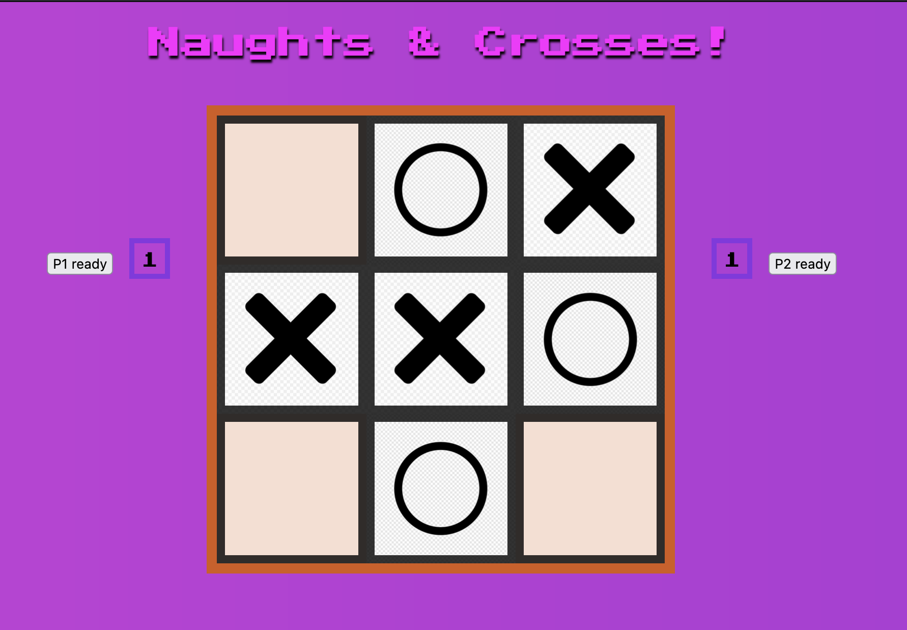

# NAUGHTS AND CROSSES 
> Play Naughts and Crosses! Free!
> Play here: [https://ajunx8.github.io/project0](https://ajunx8.github.io/project0). 

## Table of Contents
* [General Info](#general-information)
* [Technologies Used](#technologies-used)
* [Features](#features)
* [Screenshots](#screenshots)
* [Setup](#setup)
* [Project Status](#project-status)
* [Room for Improvement](#room-for-improvement)
* [Acknowledgements](#acknowledgements)
* [Contact](#contact)
<!-- * [License](#license) -->

## General Information
'Naughts and crosses' or also known as 'tic tac toe' is a simple game with two players. The board consists of a three by three grid and each player is represented by one distinct symbol, a cross or a naught. Players alternate placing their symbols on the grid, and win until 3 of their symbols are placed in a row, column or diagonal (shown with a line through the winning combo). If all the grid positions are filled without a win, the game ends in a draw.

### What problems does it solve?
'Naughts and Crosses' was first played using a pencil and paper. To play another round of this game, one must clear the grid of all symbols or redraw a new grid. With this website, players' are able to restart the game instantaneously, place symbols with one click instead of manually inscribing the symbol, and record wins effortlessly and automatically.

### What is the purpose of this project?
To allow two players to play 'Naughts and Crosses' with efficiency and ease.

### Why did I undertake this project?
To learn the general components of a full working professional software engineering project. 

## Technologies Used
- HTML5
- W3. CSS 4.15
- ES6 (ECMAScript 2018)
- jQuery v3.6.0

## Features
List the ready features here:
- Score tracker
- Reset button to reset score count
- Popping Title
- animated background color gradients
- sound effects

## Screenshots

## Setup
Play here: [https://ajunx8.github.io/project0](https://ajunx8.github.io/project0). 

## Project Status
Project is: _in progress_

## Room for Improvement

Room for improvement:
- allow players to customize their tokens (X, O, name, picture)
- add entrance animations for X and O
- use local storage to persist data locally to allow games to continue after page refresh or loss of internet connectivity.
- support custom board sizes. (4x4, 5x5, 6x6)
- support networked multiplayer
- create AI opponent.

To do:
- draw line to show a win
- allow players a choice of symbol

## Acknowledgements
- This project was inspired by: General Assembly
- Many thanks to: Loden from GA as TA for SEI54
- Animations from [Animate.css](https://animate.style/)
- Sound effects from [freesound](https://freesound.org)

## Contact
adrian.greksa@gmail.com
